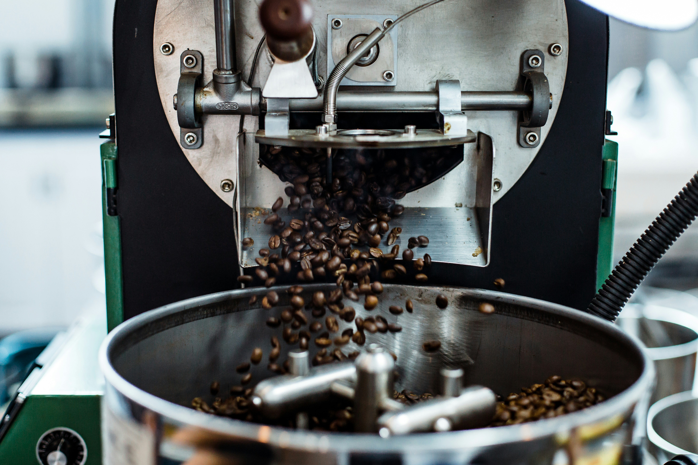
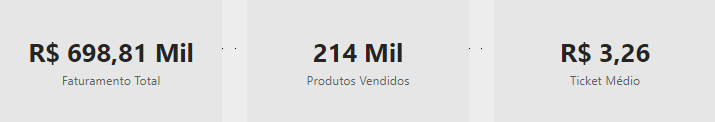
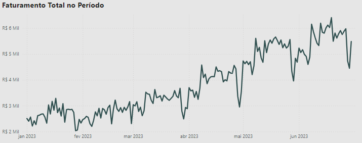
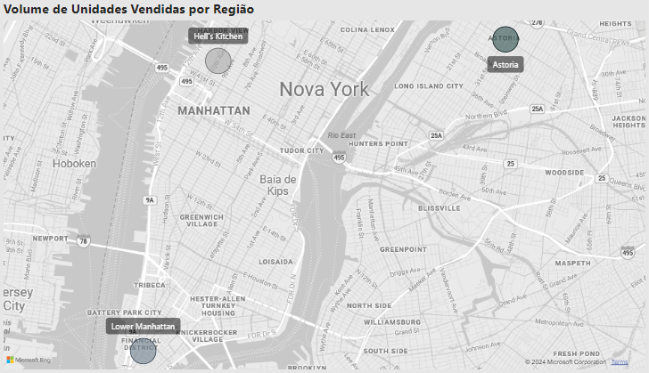
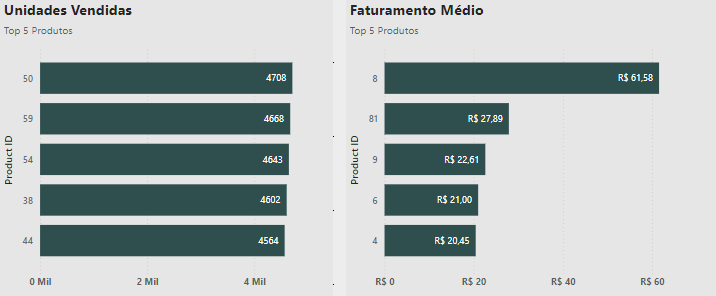
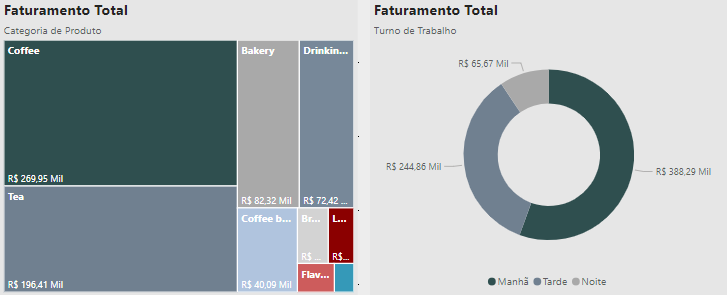
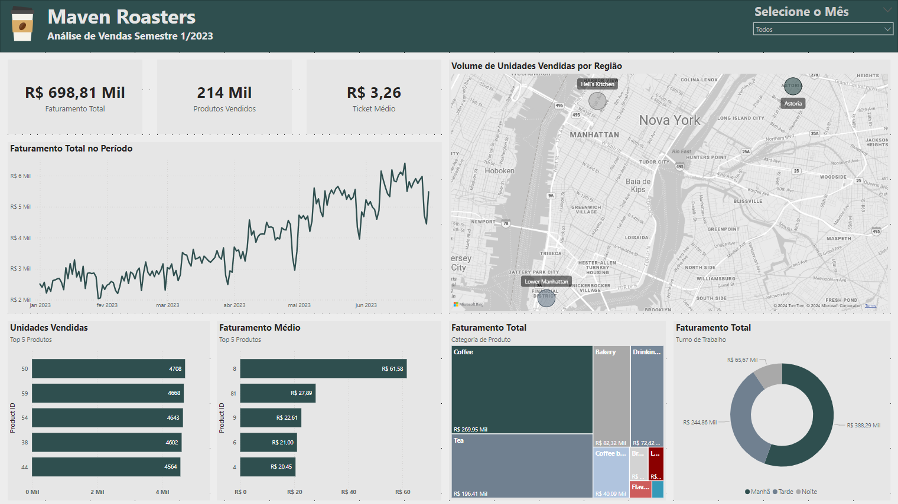

# Análise de Vendas - Maven Roasters ☕


## Conteúdos
1. [Introdução](#introdução)
2. [Metas e objetivos](#metas-e-objetivos)
3. [Dados](#dados)
4. [Analisando as vendas da cafeteria](#analisando-as-vendas-da-cafeteria)
5. [Conclusões](#conclusões-e-o-dashboard)
6. [Ferramentas utilizadas](#ferramentas-utilizadas)
7. [Contato](#contato)

## Introdução
O dataset Coffee Shop Sales contém dados sobre a Maven Roasters, uma cafeteria ficticia operando em três localizações na cidade de New York. O conjunto de dados contém data e hora de transações, localização e detalhes sobre os produtos.

## Metas e objetivos
O objetivo deste projeto é (1) responder algumas perguntas de negócios, e (2) criar um dashboard utilizando o Power BI e medidas DAX.

## Dados
|Coluna|Descrição|
|---|---|
|``transaction_id``|Identificador único da transação|
|``transaction_date``|Data da transação|
|``transaction_time``|Timestamp da transação|
|``transaction_qty``|Número de itens vendidos|
|``store_id``|ID único da loja|
|``store_location``|Localização da loja|
|``product_id``|ID único do produto|
|``unit_price``|Preço de varejo do produto|
|``product_category``|Categoria do produto|
|``product_type``|Tipo do produto|
|``product_detail``|Descrição do produto|

Os dados foram encontrados no Kaggle e estão disponíveis neste [link](https://www.kaggle.com/datasets/ahmedabbas757/coffee-sales?select=Coffee+Shop+Sales.xlsx).

## Analisando as vendas da cafeteria
Os dados tratam das vendas do primeiro semestre do ano de 2023, a _staff_ do Maven Roasters precisava entender o desempenho de vendas de suas três unidades. No contexto do Power BI o primeiro passo necessário foi criar algumas medidas DAX.

### Medidas DAX

##### Faturamento Total
```DAX
faturamentoTotal = SUMX(
    'Transactions',
    'Transactions'[transaction_qty] * 'Transactions'[unit_price]
)
```
##### Faturamento Médio
```DAX
faturamentoMedio = DIVIDE(
    'Medidas'[faturamentoTotal],
    COUNTROWS('Transactions')
)
```
##### Unidades Vendidas
```DAX
unidadesVendidas = SUMX(
    'Transactions', 
    'Transactions'[transaction_qty]
)
```
##### Ticket médio
```DAX
ticketMedio = 
VAR faturamentoTotal = [faturamentoTotal]
VAR unidadesVendidas = [unidadesVendidas]
RETURN [faturamentoTotal] / unidadesVendidas
```
### Visualizações

A Maven Roasters teve um faturamento de aproximadamente 700.000,00 em suas 3 unidades, e tem um ticket médio de 3,26. 



O faturamento apresenta uma tendência de aumento, mas é possível observar que ao fim de cada mês existe uma queda de faturamento. Uma solução para amenizar pode ser a criação de promoções especiais durante estes períodos. 



As três unidades tem o volume de vendas quase que igual, cada uma vendendo aproximadamente 70mil unidades de produtos. 



##### Os produtos mais vendidos são:
1. Brewed Black tea - Earl Grey Rg (id 50);
2. Hot Chocolate - Dark Chocolate Lg (id 59);
3. Brewed Chai tea - Morning Sunrise Chai Rg (id 54);
4. Barista Espresso - Latte (id 38);
5. Brewed herbal tea - Peppermint Rg (id 44).

##### Os produtos mais rentáveis:
1. Premium Beans - Civet Cat (id 8);
2. Clothing - I Need My Bean! T-Shirt (id 81);
3. Organic Beans - Organic Decaf Beans (id 9);
4. Gourmet Beans - Ethiopia (id 6);
5. Espresso Beans - Primo Espresso Roast (id 4).



Por fim vemos que chás e cafés representam mais da metade do faturamento, produtos de padaria também representam uma fatia interessante dos rendimentos da Maven Roasters. Mas é interessante buscar aumentar o volume de vendas dos produtos mais rentáveis, os Coffee Beans. As manhãs são o horário de funcionamento que representa o maior faturamento o que é natural se tratando de uma cafeteria.



## Conclusões
A Maven Roasters está em plena ascenção, e existe espaço para crescimento do faturamento. Minhas recomendações após a análise são:
- Buscar formas de aumentar o volume de vendas dos Coffee Beans, são em média os produtos mais rentáveis da cafeteria e representam apenas 7,31% do faturamento total;
- Existe uma tendência de queda das vendas ao fim do mês, é um período interessante para promoções regulares ou queima de queima de estoque.



## Ferramentas utilizadas


## Contato
- Email: andreluizlcons@gmail.com
- Linkedin: https://www.linkedin.com/in/andreluizls1/
- Telefone: +55 88 999934237